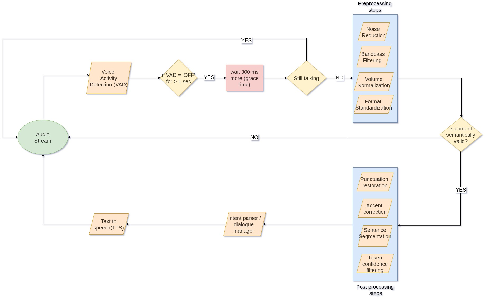

# Part 2: Robust STT Pipeline for Elderly Callers with Accents & Background Noise

  
*Figure 1: Layered architecture for STT/TTS reliability*

This architecture addresses challenges in real-time voice interaction, particularly with elderly callers who may speak with strong accents (e.g., Bengali, Spanish) and use noisy landline environments.

---

## High-Level Strategy

- Real-time **Voice Activity Detection (VAD)**
- Grace-based **pause handling**
- Robust **audio preprocessing**
- Intelligent **post-STT correction**
- **Semantic validation** before intent resolution

---

## Pipeline Breakdown

### 1. Audio Stream Input
Captures live audio from callers using mobile or landline devices.

---

### 2. Voice Activity Detection (VAD)
Detects active speech segments using:
- [`webrtcvad`](https://github.com/wiseman/py-webrtcvad)
- [`silero-vad`](https://github.com/snakers4/silero-vad)

**Triggers** after ≥1 second of silence to mark sentence boundaries.

---

### 3. Grace Period Wait (300ms)
Implements a short delay before assuming the speaker is finished — especially useful for elderly callers with slow or hesitant speech patterns.

---

### 4. Still-Talking Check
If speech resumes:
- → Continue streaming  
If silence persists:
- → Proceed to **audio preprocessing**

---

### 5. Audio Preprocessing

| **Step**              | **Purpose**                                     | **Tools / Models**                                      |
|-----------------------|--------------------------------------------------|----------------------------------------------------------|
| Noise Reduction       | Remove static/hiss from poor-quality lines       | `noisereduce`, `RNNoise`                                 |
| Bandpass Filtering    | Focus on human voice frequencies (300–3400 Hz)   | `scipy.signal`, `librosa`                                |
| Volume Normalization  | Equalize inconsistent volume levels              | `pydub`, `librosa`, `SoX`                                |
| Silence Trimming      | Eliminate trailing/leading silences              | `pydub.silence`, `librosa.effects.trim`                  |
| Resampling & Format   | Standardize to 16kHz mono WAV                    | `ffmpeg`, `torchaudio.transforms.Resample`               |

---

### 6. Speech-to-Text (STT) & Post-Processing

| **Step**                | **Purpose**                                      | **Tools / Models**                                      |
|-------------------------|--------------------------------------------------|----------------------------------------------------------|
| STT                     | Core transcription engine                        | `Whisper Large v3`, `Google STT`                         |
| Punctuation Restoration | Add natural punctuation for readability          | `punctuator2`, `DeepSegment`, `T5-small`                 |
| Accent Correction       | Normalize regional mispronunciations             | Fine-tuned `BERT`, rules, adapters                       |
| Sentence Segmentation   | Break output into clean, logical chunks          | `spaCy`, `nltk.sent_tokenize`                            |
| Confidence Filtering    | Discard unreliable segments                      | `avg_logprob`, `no_speech_prob` from Whisper output      |

---

### 7. Semantic Validation

Performs intent matching to determine if transcription yields a **valid action** (e.g., booking, canceling).  
- ✅ Valid → Forward to Dialogue Manager  
- ❌ Invalid → Re-prompt user without restarting session

---

## Reliability Challenges & Mitigations

| **Challenge**                        | **Mitigation Strategy**                                               |
|--------------------------------------|------------------------------------------------------------------------|
| Long pauses in elderly speech        | Grace timing + “still-talking” checks                                 |
| Strong non-native accents            | Whisper’s multilingual model + custom accent correction               |
| Background static / line distortion  | Denoising and bandpass filtering                                      |
| Inconsistent voice loudness          | Volume normalization                                                  |
| Mispronunciations / vague phrasing   | Semantic fallback prompts + no session reset                          |

---

## STT Pipeline Configuration

###  VAD Layer
- Tools: `webrtcvad`, `silero-vad`  
- Role: Lightweight, real-time voice activity gating

###  STT Engine
- Models: `Whisper Large v3`, `Google STT`  
- Role: Robust handling of accents, noisy conditions, long-form speech

---

##  Evaluation Metrics

| **Metric**              | **Purpose**                               | **Toolset**                        |
|-------------------------|--------------------------------------------|------------------------------------|
| Signal-to-Noise Ratio   | Quantifies preprocessing noise suppression | `librosa`, `soundfile`             |
| Word Error Rate (WER)   | Measures STT transcription accuracy        | `jiwer`, `asr_evaluation`          |
| BLEU / ROUGE            | Assesses fidelity of post-processed output | `nltk`, `rouge_score`              |
| Human Review Score      | Validates clarity of accent and phrasing   | Manual QA / Crowdsource review     |

---

 **Conclusion:**  
This pipeline balances robustness, speed, and clarity. Through adaptive pause handling, high-accuracy transcription, and accent-aware correction, it ensures a seamless experience for elderly users with diverse speech patterns.

