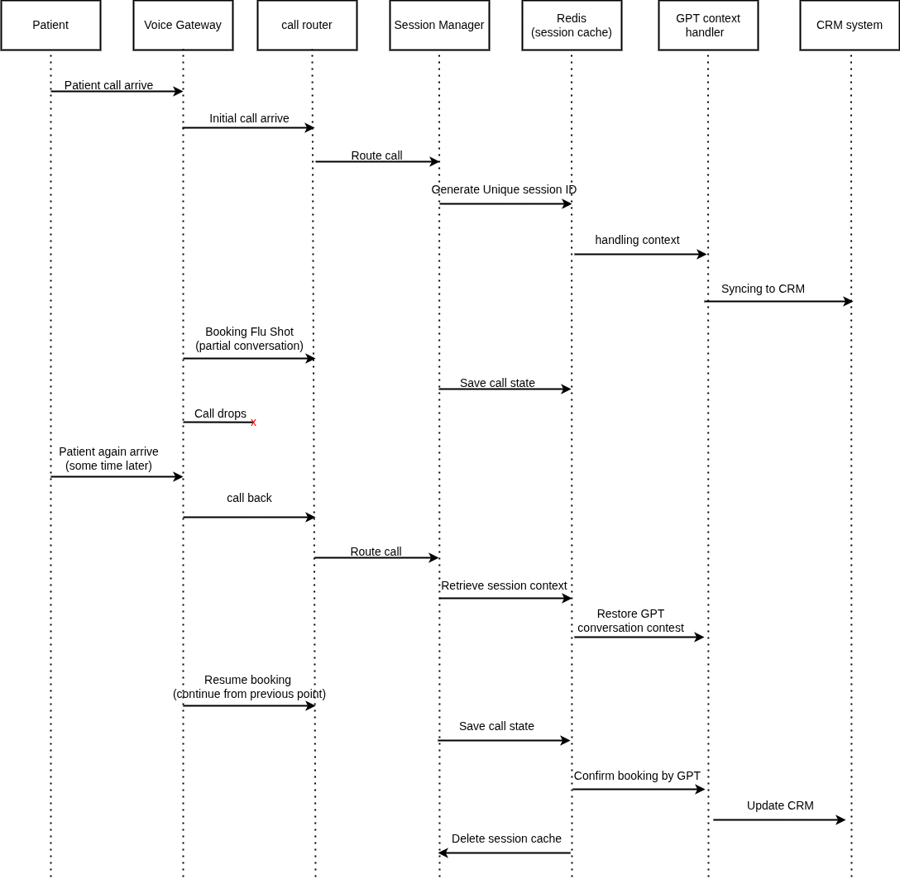

# Part 3: Backend Reliability (System Integration)

## Scenario Overview

> A **patient calls** in to **book a flu shot**.  
> The **call drops mid-way**.  
> The **patient calls back** later.  
> The **system resumes the call where it left off**.

---

## Solution Architecture

*Figure 2: Solution Architecture*

### Initial Call Flow (Patient calls to book flu shot):

1. **Patient calls in → Voice Gateway receives the call**
2. **Voice Gateway routes to Call Router**
3. **Speech-to-Text (STT)** converts the patient's voice to text
4. **Session Manager** checks:
   - “IF session exists” → **NO (new call)**
5. **New session created** in Redis Cache with:
   - Session ID
   - Call state (`booking_flu_shot`)
   - Partial conversation log
6. **GPT Service** handles the booking dialog and stores:
   - Context
   - Booking progress
7. **Call drops mid-way**
   - Session remains active in Redis (incomplete)

---

### Call Recovery Flow (Patient calls back):

1. **Patient calls again → Voice Gateway → Call Router → STT**
2. **Session Manager** checks:
   - “IF session exists” → **YES**
3. **Recover session from Redis**, including:
   - Previous call state
   - GPT context
   - Booking progress
4. **GPT resumes dialog**:
   - _“Welcome back! You were booking a flu shot. We were at selecting a date…”_
5. **Patient completes booking**
6. **If booking completed**, then:
   - CRM system updates:
     - Appointment info
     - Patient details
     - Interaction history
7. **TTS responds** with confirmation to patient
8. **Session marked as complete**
9. **Session deleted** from Redis

---

## Flow Architecture

*Figure 2: Flow Chart*

### Phase 1: Initial Call (Before Drop)

- **Patient calls in**
  - Dials healthcare to book flu shot
- **Voice Gateway** receives incoming call
  - Recognizes new session
- **Call Router** forwards to **Session Manager**
- **Session Manager**:
  - Generates `Session ID` (e.g., UUID)
  - Initializes session context

#### Conversation Begins
- Starts flu shot booking flow
- Prompts: "What date would you prefer?"
- Saves progress:
  - Phone number
  - Stage: `booking_flu_shot`
  - GPT conversation history
  - Partial booking data

#### Call Drops
- Session remains in Redis
- Marked incomplete

---

### Phase 2: Call Recovery (Patient Calls Back)

- **Same phone number** detected
- **Voice Gateway → Call Router → Session Manager**
- **Redis queried** for active sessions

#### Session Found:
- GPT context + call state restored
- Continues dialog from where left off:
  - _“Welcome back! You were booking a flu shot for next week…”_

#### Final Steps:
- Patient completes booking
- Session Manager updates:
  - CRM with appointment + patient info
  - Logs both call sessions
- Deletes session from Redis after completion